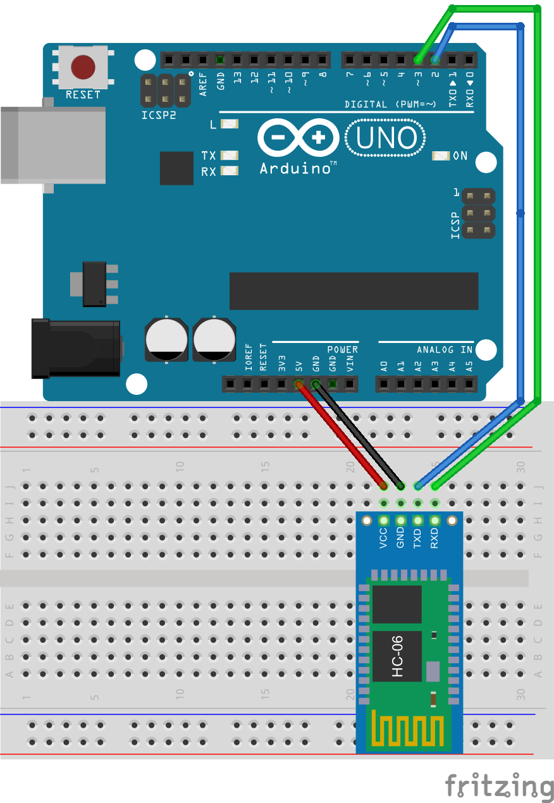

##Bluetooth Bot.

This project is for driving your carlbot using a usb gamepad hooked up to your computer using bluetooth.

You'll need: 

- [HC06 Bluetooth adapter](http://www.amazon.com/s/ref=nb_sb_noss_2?url=search-alias%3Daps&field-keywords=HC-06) - The bluetooth adapter to hook up to your robot.
- [CarlPad](https://chrome.google.com/webstore/detail/carlpad/doklkdakcgcanlplenidpdoipnefpgic) - A plugin for Google Chrome to use to drive your robot
- USB Gamepad - For example the [Rock Candy PS3 Controller](http://www.amazon.com/Rock-Candy-PS3-Controller-PlayStation-3/dp/B008U2XEBM/ref=sr_1_2?ie=UTF8&qid=1434123699&sr=8-2&keywords=rock+candy+gamepad)

## Circuit

## Sketch 
